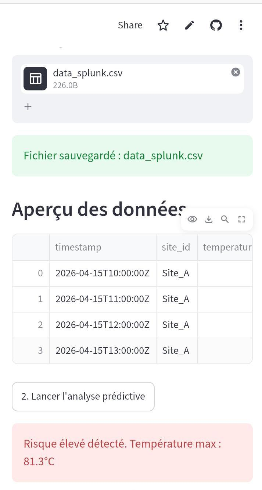

# Maintenance Prédictive - Panneaux Solaires AI Bénin

Projet pour XPRIZE : Détection précoce des pannes de panneaux solaires au Bénin avec l'IA.

## 📊 Aperçu

L'IA détecte un `Risque élevé` quand la température dépasse 80°C sur les données `data_splunk.csv`.

## ⚙️ Comment utiliser
1.  Va sur le lien Demo ci-dessus
2.  Clique sur `Parcourir les fichiers` et upload `data_splunk.csv`
3.  Clique sur `Lancer l'analyse prédictive` pour voir l'alerte.

## 🛠️ Techno utilisées
Python, Streamlit, Pandas

## 📁 Fichiers du projet
`app.py` : Code principal Streamlit
`data_splunk.csv` : Données avec anomalie simulée
`data_normal.csv` : Données normales
`requirements.txt` : Librairies Python
